# Deseño

## Casos de uso

Diagrama de caso de usos realizado a partir de [Canva](https://www.canva.com/)

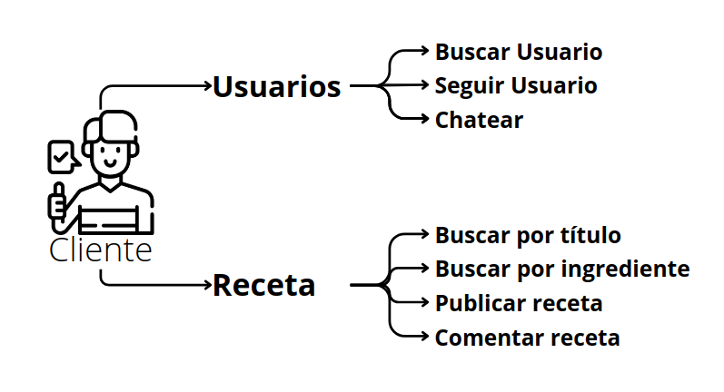

## Deseño de interface de usuarios

Mockups de la web realizados a partir de [Canva](https://www.canva.com/)

### Disposición Completa.

Disposición pensada para resoluciones de pantalla completa en pantallas normales o grandes.

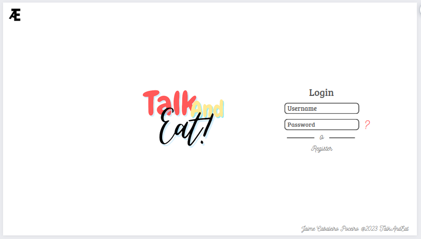
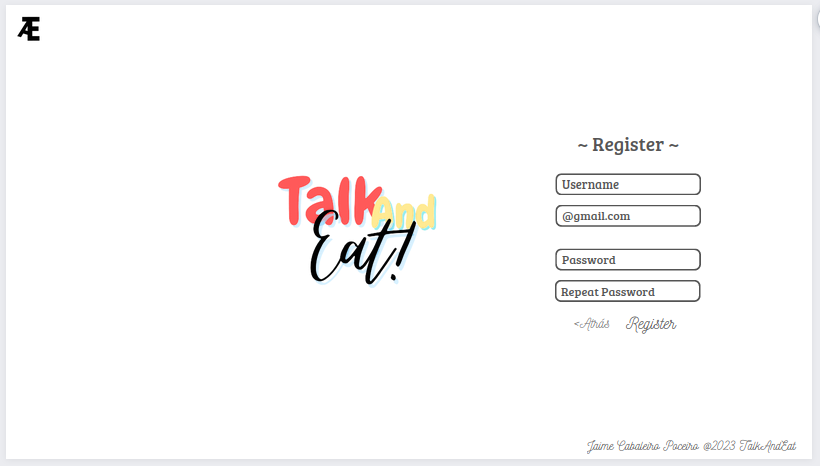
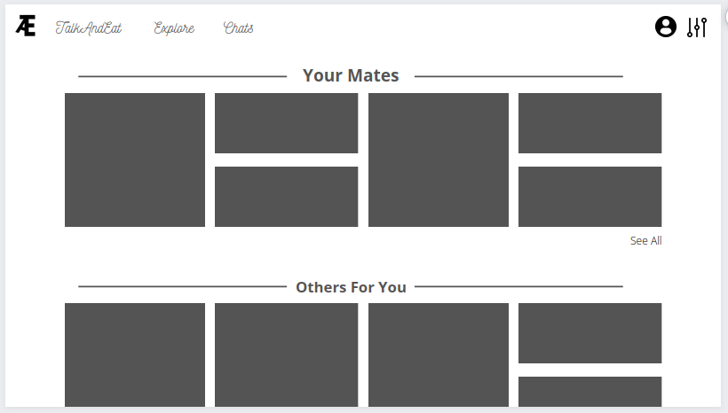
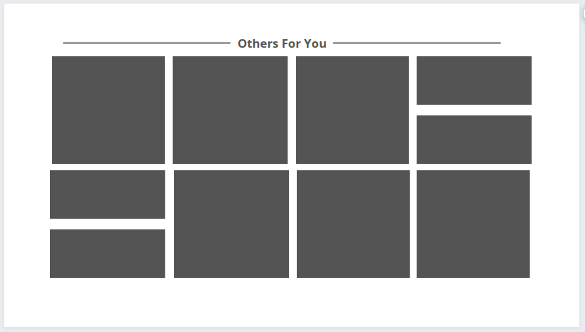
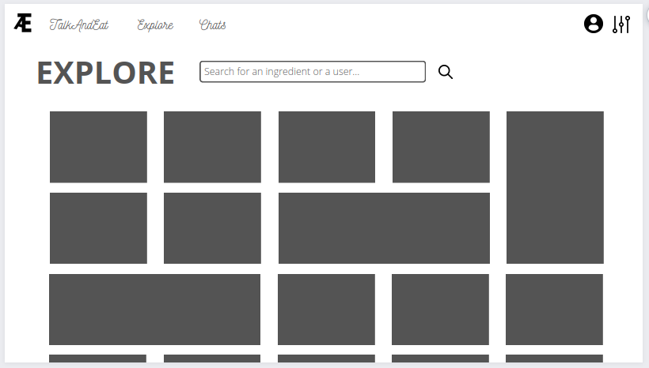
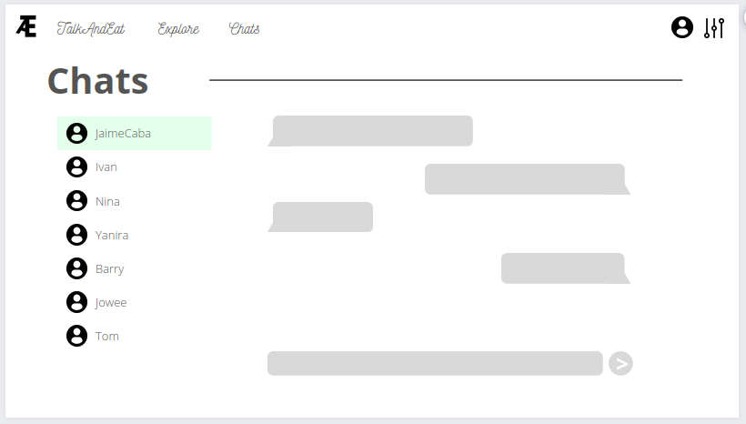
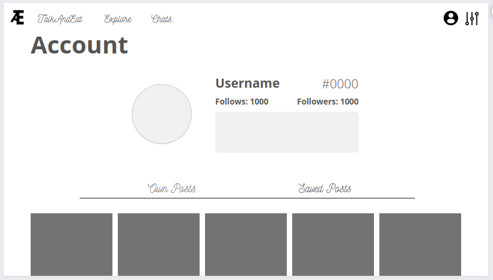

### Disposición Reducida.

Disposición pensada para resoluciones mas reducidas del dispositivo.

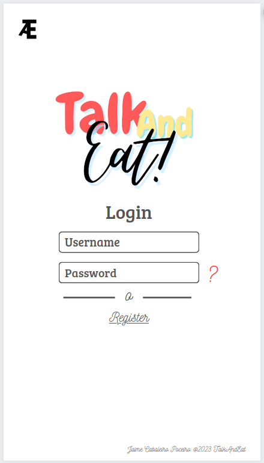
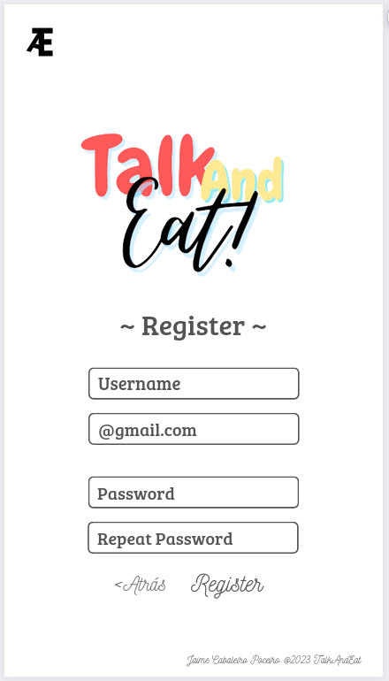
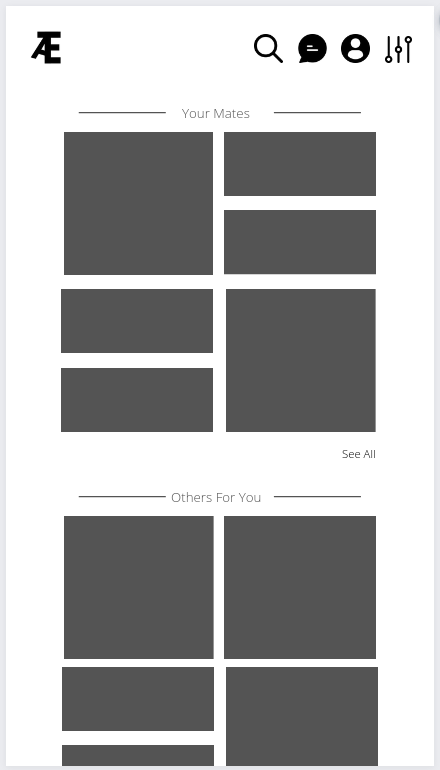
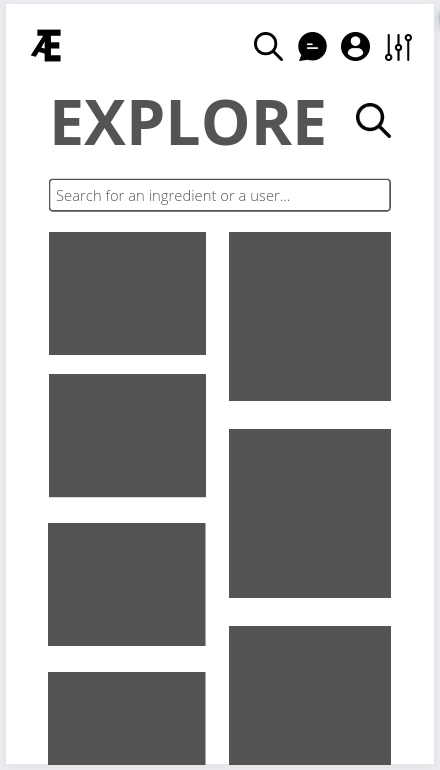
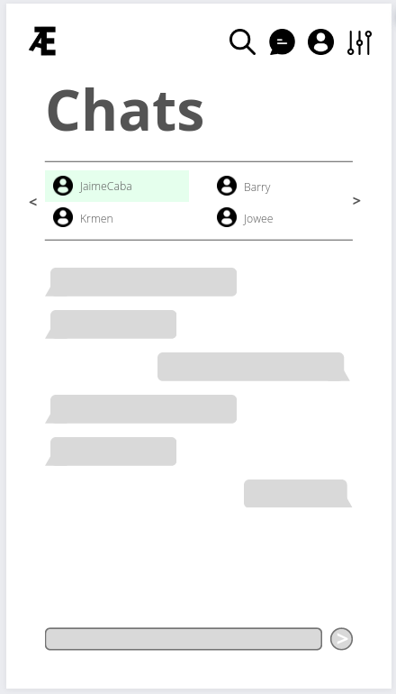
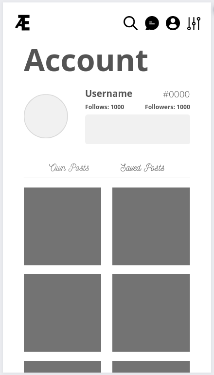

## Diagrama de Base de Datos

### Entidad Relación

Diagrama hecho a partir de [dbDiagram.io](https://dbdiagram.io/home)

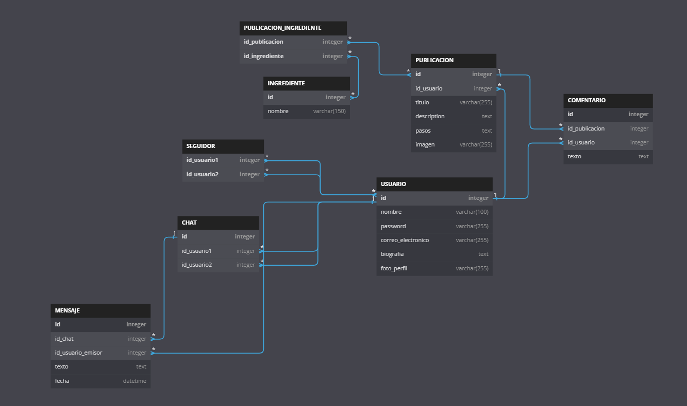

### Paso al modelo Relacional

    USUARIO (ID_usuario, nombre, contrasena, correo_electronico, biografia, foto_perfil)

    PUBLICACION (ID_publicacion, ID_usuario, titulo, descripcion, pasos, imagen)

    INGREDIENTE (ID_ingrediente, nombre)

    PUBLICACION_INGREDIENTE (ID_publicacion, ID_ingrediente)

    COMENTARIO (ID_comentario, ID_publicacion, texto)

    SEGUIDOR (ID_usuario_seguidor, ID_usuario_seguido)

    CHAT (ID_chat, ID_usuario1, ID_usuario2)

    MENSAJE (ID_mensaje, ID_chat, ID_usuario_emisor, texto, fecha)

### Explicación

La tabla USUARIO almacena información sobre los usuarios registrados, incluyendo un ID único, nombre, contraseña, correo electrónico, biografía y foto de perfil.

La tabla PUBLICACION almacena información sobre las recetas publicadas por los usuarios. Tiene un ID único, un ID de usuario que indica quién publicó la receta, título, descripción, pasos y una imagen opcional.

La tabla INGREDIENTE almacena información sobre los ingredientes utilizados en las recetas. Tiene un ID único y un nombre.

La tabla PUBLICACION_INGREDIENTE es una tabla intermedia que relaciona las publicaciones con los ingredientes que utilizan. Tiene dos columnas: ID_publicacion e ID_ingrediente.

La tabla COMENTARIO almacena los comentarios realizados por los usuarios en las publicaciones. Tiene un ID único, un ID de publicación que indica a qué publicación se refiere el comentario y un campo de texto que contiene el comentario en sí.

La tabla SEGUIDOR almacena información sobre los usuarios que siguen a otros usuarios. Tiene un ID de usuario seguidor y un ID de usuario seguido.

La tabla CHAT almacena información sobre las conversaciones privadas entre dos usuarios. Tiene un ID único, un ID de usuario1 y un ID de usuario2.

La tabla MENSAJE almacena los mensajes enviados en una conversación. Tiene un ID único, un ID de chat que indica a qué conversación se refiere el mensaje, un ID de usuario emisor que indica quién envió el mensaje, texto y fecha.

### Script SQL de creación

Para crear la base de datos ejecutar el script ".sql" del dentro de la carpeta raiz del proyecto en "db/createDB.sql" o insertar en la base de datos la siguente sentencia de código.
 create database TalkAndEat;
 use TalkAndEat;
   CREATE TABLE USUARIO (
        ID_usuario INT NOT NULL IDENTITY(1,1),
        nombre VARCHAR(50) NOT NULL UNIQUE,
        contrasena VARCHAR(255) NOT NULL,
        correo_electronico VARCHAR(255) NOT NULL UNIQUE,
        biografia TEXT,
        foto_perfil VARCHAR(255),
        PRIMARY KEY (ID_usuario)
    );

    CREATE TABLE PUBLICACION (
        ID_publicacion INT NOT NULL IDENTITY(1,1),
        ID_usuario INT NOT NULL,
        titulo VARCHAR(255) NOT NULL,
        descripcion TEXT NOT NULL,
        imagen VARCHAR(255),
        duracion INT NOT NULL,
        PRIMARY KEY (ID_publicacion),
        FOREIGN KEY (ID_usuario) REFERENCES USUARIO(ID_usuario)
    );

    CREATE TABLE INGREDIENTE (
        ID_ingrediente INT NOT NULL IDENTITY(1,1),
        nombre VARCHAR(50) NOT NULL,
        PRIMARY KEY (ID_ingrediente)
    );

    CREATE TABLE PUBLICACION_INGREDIENTE (
        ID_publicacion INT NOT NULL,
        ID_ingrediente INT NOT NULL,
		unidad varchar(50) not null, 
		cantidad int not null, 
        PRIMARY KEY (ID_publicacion, ID_ingrediente),
        FOREIGN KEY (ID_publicacion) REFERENCES PUBLICACION(ID_publicacion),
        FOREIGN KEY (ID_ingrediente) REFERENCES INGREDIENTE(ID_ingrediente)
    );

    CREATE TABLE PUBLICACION_PASO(
        ID_publicacion INT NOT NULL,
        ID_paso INT NOT NULL IDENTITY(1,1),
        orden int not null ,
        texto TEXT NOT NULL,
        FOREIGN KEY (ID_publicacion) REFERENCES PUBLICACION(ID_publicacion),
    );

    CREATE TABLE COMENTARIO (
        ID_comentario INT NOT NULL IDENTITY(1,1),
        ID_publicacion INT NOT NULL,
        ID_usuario INT NOT NULL,
        texto TEXT NOT NULL,
        PRIMARY KEY (ID_comentario),
        FOREIGN KEY (ID_usuario) REFERENCES USUARIO(ID_usuario),
        FOREIGN KEY (ID_publicacion) REFERENCES PUBLICACION(ID_publicacion)
    );

    CREATE TABLE SEGUIDOR (
        ID_usuario_seguidor INT NOT NULL,
        ID_usuario_seguido INT NOT NULL,
        estado bit default 0,
        PRIMARY KEY (ID_usuario_seguidor, ID_usuario_seguido),
        FOREIGN KEY (ID_usuario_seguidor) REFERENCES USUARIO(ID_usuario),
        FOREIGN KEY (ID_usuario_seguido) REFERENCES USUARIO(ID_usuario)
    );

    CREATE TABLE CHAT (
        ID_chat INT NOT NULL IDENTITY(1,1),
        ID_usuario1 INT NOT NULL,
        ID_usuario2 INT NOT NULL,
        PRIMARY KEY (ID_chat),
        FOREIGN KEY (ID_usuario1) REFERENCES USUARIO(ID_usuario),
        FOREIGN KEY (ID_usuario2) REFERENCES USUARIO(ID_usuario)
    );

    CREATE TABLE MENSAJE (
        ID_mensaje INT NOT NULL IDENTITY(1,1),
        ID_chat INT NOT NULL,
        ID_usuario_emisor INT NOT NULL,
        texto TEXT NOT NULL,
        fecha DATETIME NOT NULL,
        PRIMARY KEY (ID_mensaje),
        FOREIGN KEY (ID_chat) REFERENCES CHAT(ID_chat),
        FOREIGN KEY (ID_usuario_emisor) REFERENCES USUARIO(ID_usuario)
    );